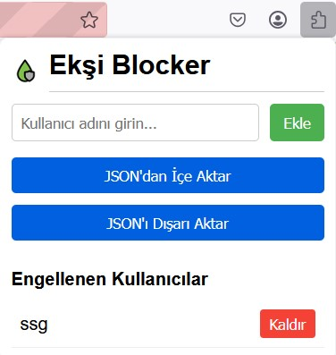

# Eksi Blocker

eksisozluk.com'da üyelik açmaya gerek kalmadan kullanıcı engelleyebildiğiniz Firefox eklentisi.

## Özellikler

- Belirli kullanıcıların göndelerini bulanıklaştırma ve isteğe göre görüntüleme
- Kolayca kullanıcı eklenip kaldırılabilen arayüz
- Birden fazla kullanıcının eklenebildiği JSON yükleme desteği

## Kullanım

### Yöntem 1: Popup ile Engelleme

1. Araç çubuğundaki eklenti simgesine tıklayın  
2. Engellemek istediğiniz bir kullanıcı adını girin  
3. "Ekle" butonuna tıklayın veya Enter tuşuna basın  
4. Bir kullanıcıyı engellemekten çıkarmak için, adının yanındaki "Kaldır" butonuna tıklayın  

### Yöntem 2: Entry Üzerinden Engelleme

1. Sözlükte herhangi bir entry'deki engelle butonunu kullanın
2. Kullanıcı anında engellenir ve listede görünür
3. Engeli kaldırmak için popup menüden kullanıcının yanındaki "Kaldır" butonunu kullanabilirsiniz

## Resimler

## Gelecek Geliştirmeler

- [ ] Entry'yi favlayanları toplu engelleme özelliği
- [ ] Belirli bir kullanıcıyı takip edenleri toplu engelleme özelliği
- [ ] Chrome tarayıcı desteği